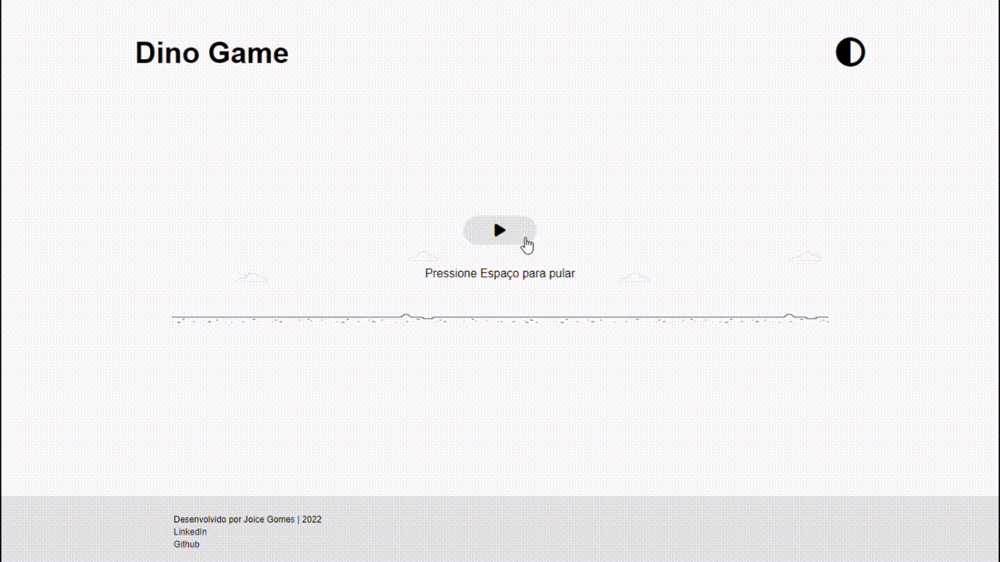

# DINO GAME - Desafio Recriando o jogo do dinossauro sem internet
Projeto desenvolvido para o desafio Recriando o famoso jogo do dinossauro sem internet.  

Para o desenvolvimento do jogo foi utilizado HTML, CSS e JavaScript.  

Com o JavaScript, também implementei a ferramenta de mudança da página para modo escuro ou claro.

O jogo pode ser acessado por um navegador de internet.